# 📊 Retail Sales & Inventory Analytics Dashboard

[](https://www.python.org/)
[](https://www.mysql.com/)
[](https://powerbi.microsoft.com/)

**Project Type**: End-to-End Data Analytics / Business Intelligence  
**Tech Stack**: Python (pandas, mysql-connector-python), MySQL, Power BI Desktop  
**Dataset**: ~73,000 rows from Kaggle Retail Store Inventory Forecasting Dataset  
**Time Period**: Daily sales & inventory records spanning multiple years

---

## 🎯 Project Objective

Build a complete analytics system to help retail businesses understand sales performance, detect inventory risks (stockouts & overstock), uncover seasonal patterns, and support data-driven inventory & merchandising decisions.

---

## 💼 Business Problem Addressed

Retailers frequently face two costly problems:

- **Stockouts**: Lost sales when inventory is too low during high-demand periods
- **Overstock**: Tied-up capital, storage costs, and obsolescence when inventory is too high

### Solution Approach

This project creates a scalable, automated analytics pipeline and dashboard to:

✅ Monitor real-time sales & inventory health  
✅ Flag high-risk products early  
✅ Visualize trends and seasonality to inform buying & promotion strategies  
✅ Enable data-driven decision-making for inventory management

---

## 🏗️ End-to-End Architecture & Workflow

```mermaid
flowchart TD
    A[📄 Raw CSV Data<br/>~73,000 rows] --> B[🐍 Python ETL Pipeline]
    B --> B1[Data Cleaning]
    B --> B2[Feature Engineering]
    B1 --> C
    B2 --> C
    C[🗄️ MySQL Database] --> C1[Risk Metrics Calculation]
    C1 --> D[📊 Power BI Dashboard]
    D --> D1[Interactive Visualizations]
    D --> D2[KPIs & Analytics]
    
    style A fill:#bbdefb,stroke:#0d47a1,stroke-width:2px,color:#000
    style B fill:#ffcc80,stroke:#e65100,stroke-width:3px,color:#000
    style B1 fill:#ffb74d,stroke:#e65100,stroke-width:1px,color:#000
    style B2 fill:#ffb74d,stroke:#e65100,stroke-width:1px,color:#000
    style C fill:#ce93d8,stroke:#4a148c,stroke-width:3px,color:#000
    style C1 fill:#ba68c8,stroke:#4a148c,stroke-width:1px,color:#000
    style D fill:#a5d6a7,stroke:#1b5e20,stroke-width:3px,color:#000
    style D1 fill:#81c784,stroke:#1b5e20,stroke-width:1px,color:#000
    style D2 fill:#81c784,stroke:#1b5e20,stroke-width:1px,color:#000
```



### 1. **Data Ingestion & ETL** 📥

- **Source**: Raw CSV (~73,000 rows) containing:
  - Date, Store ID, Product ID, Category, Region
  - Units Sold, Inventory Level, Price, Discount
  - Weather Condition, Holidays, Competitor Pricing, etc.

- **Python Script** (`scripts/retail_pipeline.py`):
  - Loads CSV using pandas
  - Handles data types, missing values, date parsing
  - Performs basic cleaning & feature engineering
  - Inserts records into MySQL in batches (5,000 rows/batch) for efficiency

### 2. **Database Layer (MySQL)** 🗄️

- **Schema**: Normalized tables designed for analytics
  - `sales_transactions`: Core sales and inventory data
  - `inventory_risk_metrics`: Calculated risk indicators
  - `generated_demand_forecasts`: Future demand predictions (extensible)

- **Automated SQL Scripts**:
  - `initial.sql`: Creates database schema and tables
  - `risk_metrics.sql`: Calculates:
    - Turnover rate (units sold / inventory)
    - Stockout risk flags (low inventory + high recent sales)
    - Overstock risk flags (high inventory + low sales)
    - Risk level categorization (Normal / High Stockout Risk / High Overstock Risk)

### 3. **Risk Scoring Logic** 🚨

Custom thresholds (tunable based on business requirements):

| Risk Type | Condition | Threshold |
|-----------|-----------|-----------|
| **Stockout Risk** | Low inventory + High sales | Inventory ≤ 40 AND Units Sold ≥ 25 |
| **Overstock Risk** | High inventory + Low sales | Inventory ≥ 350 AND Units Sold ≤ 8 |

**Results**: 521 products flagged across the dataset (primarily overstock in certain categories)

### 4. **Power BI Dashboard** 📈

Interactive 3-page dashboard providing comprehensive retail analytics. See the [Dashboard Screenshots](#-dashboard-screenshots) section below for detailed visualizations.

---

## 🚀 Getting Started

### Prerequisites

- **Python 3.8+** with pip
- **MySQL Server 8.0+**
- **Power BI Desktop** (for viewing dashboard)
- **Dataset**: Included in repository (`retail_store_inventory.csv`) or download from [Kaggle](https://www.kaggle.com/)

### Installation

1. **Clone the repository**
   ```bash
   git clone https://github.com/yourusername/retail-sales-analytics.git
   cd retail-sales-analytics
   ```

2. **Install Python dependencies**
   ```bash
   pip install pandas mysql-connector-python
   ```

3. **Set up MySQL Database**
   - Start your MySQL server
   - Run the schema creation script:
     ```bash
     mysql -u root -p < initial.sql
     ```

4. **⚠️ Configure Database Credentials**
   
   **IMPORTANT**: Before running `retail_pipeline.py`, you must manually set your database credentials:
   
   Open `scripts/retail_pipeline.py` and update lines 9-11:
   ```python
   conn = mysql.connector.connect(
       host="localhost",        # Set your MySQL host (e.g., "localhost")
       user="your_username",    # Set your MySQL username (e.g., "root")
       password="your_password", # Set your MySQL password
       database="retail_db",
       raise_on_warnings=True
   )
   ```

5. **Prepare the Dataset**
   - The project includes `retail_store_inventory.csv` (5.9 MB, ~73,000 rows)
   - Alternatively, download fresh data from Kaggle
   - Update the CSV path in `scripts/retail_pipeline.py` (line 110) if needed:
     ```python
     csv_path = r"e:\Work\Retail Sales Project\retail_store_inventory.csv"
     ```

### Running the Pipeline

1. **Execute the ETL script**
   ```bash
   python scripts/retail_pipeline.py
   ```
   This will:
   - Load and clean the CSV data
   - Insert ~73,000 rows into MySQL
   - Display progress in batches

2. **Calculate Risk Metrics**
   ```bash
   mysql -u root -p retail_db < risk_metrics.sql
   ```

3. **Open Power BI Dashboard**
   - Launch Power BI Desktop
   - Open `Retail Dashboard.pbix`
   - When prompted, update the data source connection:
     - **Server**: localhost (or your MySQL host)
     - **Database**: retail_db
     - **Username/Password**: (your MySQL credentials)
   - Click **"Refresh"** to load data from MySQL

---

## 📁 Project Structure

```
retail-sales-analytics/
│
├── scripts/
│   └── retail_pipeline.py          # ETL pipeline (Python, 3.8 KB)
│
├── screenshots/                     # Dashboard screenshots
│   ├── page1.png                    # Overview page
│   ├── page2.png                    # Trends & Seasonality page
│   └── page3.png                    # Inventory Risks page
│
├── Retail Dashboard.pbix            # Power BI Dashboard (2.27 MB)
├── retail_store_inventory.csv       # Dataset (~73K rows, 5.9 MB)
├── initial.sql                      # Database schema creation (1.4 KB)
├── risk_metrics.sql                 # Risk metrics calculation (1.5 KB)
│
└── README.md                        # Project documentation
```

---

## 🎯 Key Achievements & Outcomes

✅ Processed realistic retail-scale data (73,000+ rows)  
✅ Automated full ETL → Database → Dashboard refresh workflow  
✅ Created actionable risk detection (521 high-risk SKUs flagged)  
✅ Visualized business-critical insights:
   - Revenue drivers by category and region
   - Seasonal peaks and trends
   - Category under/over-performers  
✅ Demonstrated end-to-end analyst capabilities from raw data to stakeholder insights

---

## 📊 Dashboard Screenshots

The Power BI dashboard consists of 3 interactive pages designed for comprehensive retail analytics:

### 📈 Page 1: Overview

High-level business metrics and KPIs for executive summary.

**Key Features:**
- **KPIs**: Total Revenue (~$495M), Avg Units Sold (~136), High Risk Count (521), Stockout Count (0)
- **Revenue breakdown by Category** (Bar Chart) - Identify top-performing product categories
- **Risk Level Distribution** (Donut Chart) - ~99% Normal, ~1% High Overstock Risk
- **Interactive Filters**: Date range, Region, Category slicers for drill-down analysis


---

### 📉 Page 2: Trends & Seasonality

Time-series analysis to understand sales patterns and seasonal demand.

**Key Features:**
- **Revenue Over Time** (Line Chart) - Shows seasonal cycles and trends by category
- **Units Sold Trend** (Stacked Area Chart) - Regional and category-wise sales volume over time
- **Monthly Revenue Heatmap** (Matrix) - Clear visualization of seasonality patterns
- **Year-over-Year Comparisons** - Identify growth trends and anomalies


---

### 🚨 Page 3: Inventory Risks

Detailed inventory risk analysis for proactive decision-making.

**Key Features:**
- **Risk Details Table** - Product ID, Category, Region, Inventory Level, Turnover Rate, Risk Level
  - **Conditional Formatting**: Red (High Risk) / Orange (Medium) / Green (Normal)
- **Risk Count by Category/Region** (Bar Chart) - Identify problem areas
- **Risk Distribution** (Donut Chart) - Visual breakdown of inventory health
- **Actionable Insights** - Quickly identify products needing restocking or markdown


---

## 🛠️ Skills Demonstrated

| Category | Skills |
|----------|--------|
| **Data Engineering** | ETL pipeline design, batch processing, data ingestion |
| **Database** | SQL schema design, complex queries, indexing, normalization |
| **Programming** | Python (pandas, mysql-connector), automation scripting |
| **Analytics** | KPI definition, risk scoring, trend analysis, seasonality detection |
| **Visualization** | Power BI (DAX, relationships, conditional formatting, slicers, time intelligence) |
| **Business Acumen** | Translating data into actionable insights, stakeholder communication |

---

## 💡 Business Value & Transferability

This project mirrors the daily work of junior/mid-level data analysts in **retail, e-commerce, FMCG, and supply chain** companies:

- 🎯 **Identifying Revenue Opportunities**: Discover high-performing products and categories
- 🚫 **Preventing Lost Sales**: Early stockout detection minimizes revenue loss
- 💰 **Reducing Holding Costs**: Overstock identification frees up capital
- 📅 **Seasonal Demand Planning**: Historical trends inform buying and promotion strategies

### Scalability & Adaptability

- **Tunable Logic**: Risk thresholds can be adjusted based on business needs
- **Modular Design**: Each component (ETL, database, dashboard) can be modified independently
- **Interactive Dashboard**: Slicers and filters enable drill-down analysis
- **Ready for Production**: With minor adjustments, this can be deployed for real-time monitoring

---

## 🔮 Future Enhancements

- [ ] Implement demand forecasting models (ARIMA, Prophet, ML)
- [ ] Add real-time data ingestion via API
- [ ] Create automated email alerts for high-risk products
- [ ] Deploy dashboard to Power BI Service for online access
- [ ] Add customer segmentation analysis
- [ ] Integrate promotion effectiveness tracking

---

## 🙏 Acknowledgments

- Dataset: [Kaggle Retail Store Inventory Forecasting Dataset](https://www.kaggle.com/)
- Inspiration: Real-world retail analytics challenges
- Tools: Python, MySQL, Power BI

---

## 📧 Contact

For questions, suggestions, or collaboration opportunities, feel free to reach out!

**⭐ If you found this project helpful, please give it a star!**


